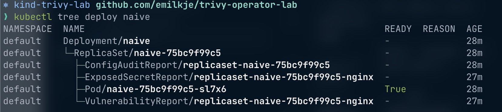

# Automatic security and config scan by Trivy

This lab uses the Trivy operator to on-the-fly scan workloads that's applied to the cluster.

The reports are properly placed in the ownership hierarchy so that the Kubernetes scheduler and garbage collector will clean up and keep the data up to date.

## Preparation

Bootstrap a new kubernetes lab cluster with Kind

```sh
cat <<EOF | kind create cluster --config -
apiVersion: kind.x-k8s.io/v1alpha4
kind: Cluster
name: trivy-lab
nodes:
- role: control-plane
EOF
```

## Install the Trivy operator with Helm

```sh
# add the chart repo
helm repo add aqua https://aquasecurity.github.io/helm-charts/
helm repo update

# install the operator
helm install trivy-operator aqua/trivy-operator \
  --namespace trivy-system \
  --create-namespace \
  --set="trivy.ignoreUnfixed=true"
```

## Apply a non-hardened workload

We'll apply a naive nginx deployment to test the configuration audit capabilities

```sh
cat <<EOF | kubectl apply -f -
apiVersion: apps/v1
kind: Deployment
metadata:
  name: naive
spec:
  selector:
    matchLabels:
      app: nginx
  template:
    metadata:
      labels:
        app: nginx
    spec:
      containers:
      - name: nginx
        image: nginx:1.20
        resources:
          limits:
            memory: "128Mi"
            cpu: "500m"
        ports:
        - containerPort: 80
EOF
```

We can observe that the Trivy operator is providing us with a configuration audit report owned by the respective `ReplicaSet`:



```yaml
apiVersion: aquasecurity.github.io/v1alpha1
kind: ConfigAuditReport
metadata:
  annotations:
    trivy-operator.aquasecurity.github.io/report-ttl: 24h0m0s
  creationTimestamp: "2023-01-10T14:38:04Z"
  generation: 1
  labels:
    plugin-config-hash: 659b7b9c46
    resource-spec-hash: 76849db67
    trivy-operator.resource.kind: ReplicaSet
    trivy-operator.resource.name: naive-75bc9f99c5
    trivy-operator.resource.namespace: default
  name: replicaset-naive-75bc9f99c5
  namespace: default
  ownerReferences:
  - apiVersion: apps/v1
    blockOwnerDeletion: false
    controller: true
    kind: ReplicaSet
    name: naive-75bc9f99c5
    uid: 769cb13e-f668-43d1-8196-bd1d36f6da56
  resourceVersion: "9787"
  uid: 8390d2b5-89f4-41a4-a04c-a7bb0e71aa76
report:
  checks:
  - category: Kubernetes Security Check
    checkID: KSV110
    description: ensure that default namespace should not be used
    messages:
    - ReplicaSet 'naive-75bc9f99c5' should not be set with 'default' namespace
    severity: LOW
    success: false
    title: The default namespace should not be used
  - category: Kubernetes Security Check
    checkID: KSV003
    description: The container should drop all default capabilities and add only those
      that are needed for its execution.
    messages:
    - Container 'nginx' of ReplicaSet 'naive-75bc9f99c5' should add 'ALL' to 'securityContext.capabilities.drop'
    severity: LOW
    success: false
    title: Default capabilities not dropped

...
```

It would be easy to use this as a reference for workload hadening. In this instance I used [the report](./naive-config-report.yaml) to harden the nginx deployment (see [nginx-hardened.yaml](./nginx-hardened.yaml)) resulting in much greater security.

## Vulnerability scan

The vulnerability scan works in a similar fassion where the controller is observing the cluster for workloads containing images and starts a scan `Job` when such a resource is discovered by the reconciliation schedule.

```yaml
...

report:
  artifact:
    repository: library/nginx
    tag: "1.20"
  registry:
    server: index.docker.io
  scanner:
    name: Trivy
    vendor: Aqua Security
    version: 0.35.0
  summary:
    criticalCount: 15
    highCount: 25
    lowCount: 6
    mediumCount: 15
    noneCount: 0
    unknownCount: 0
  updateTimestamp: "2023-01-10T14:38:40Z"
  vulnerabilities:
  - fixedVersion: 7.74.0-1.3+deb11u2
    installedVersion: 7.74.0-1.3+deb11u1
    links: []
    primaryLink: https://avd.aquasec.com/nvd/cve-2021-22945
    resource: curl
    score: 9.1
    severity: CRITICAL
    target: ""
    title: 'curl: use-after-free and double-free in MQTT sending'
    vulnerabilityID: CVE-2021-22945

...
```

See [naive-vuln-report.yaml](./naive-vuln-report.yaml) for a complete report.

## Thoughts on the ownership model

The desired state for the controllers managed by the Trivy operator is that for each workload or node there are security reports stored in the cluster as custom resources. Each custom resource is owned by a built-in resource to inherit its life cycle. Beyond that, Trivy takes advantage of Kubernetes garbage collector to automatically delete stale reports and trigger rescan. For example, deleting a ReplicaSet will delete controlee `VulnerabilityReports`, whereas deleting a `VulnerabilityReport` owned by a `ReplicaSet` will rescan that `ReplicaSet` and eventually recreate the `VulnerabilityReport`.

In other words, this ownership model ensures data security, consistency and retention by relying on the Kubernetes resource model, scheduler and garbage collection. There would be little to no operation cost assiciated with managing these reports.

This is also a model that lends well to multi tenancy because each report is always scoped under the scanned resource in the same namespace preventing data leakage.